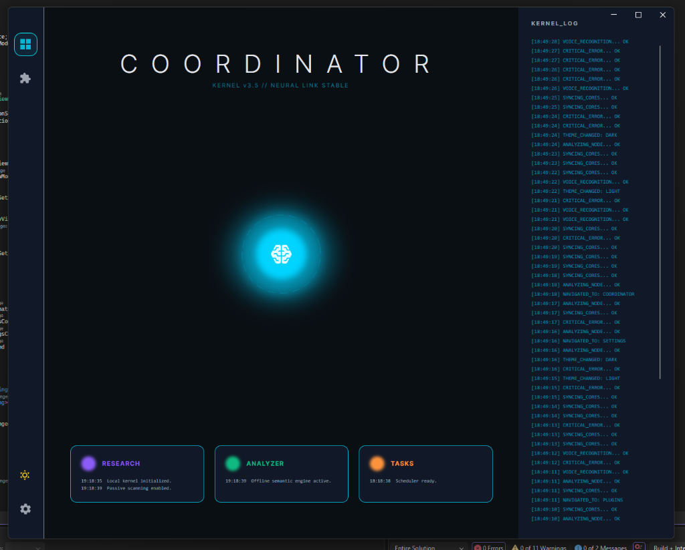
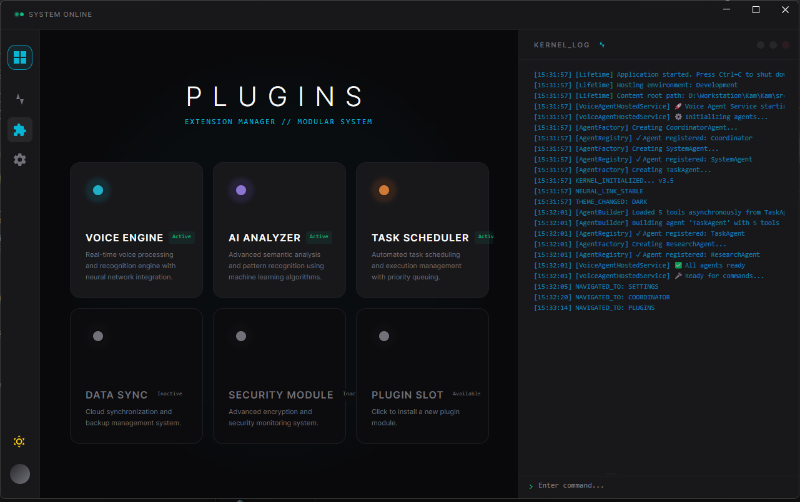
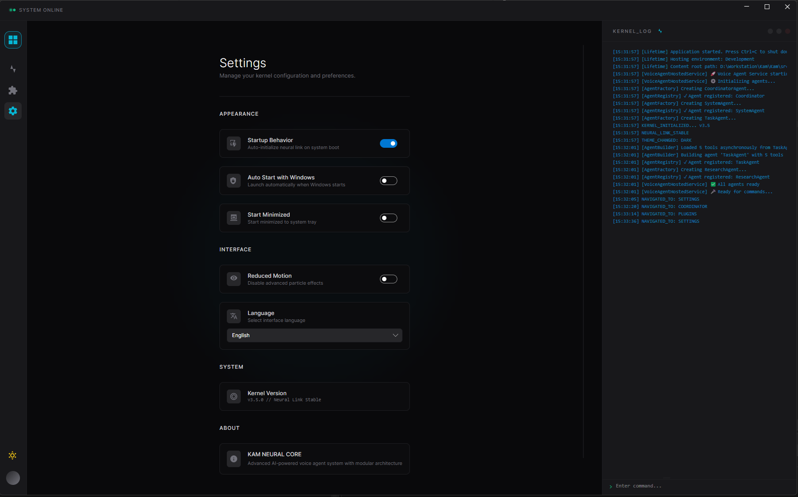

# Kam

Kam is a desktop AI agent for operating a workstation through voice, text, skills, and local context. It is designed to sit between a coding-agent style workflow and a daily assistant: it can plan with an OpenAI-compatible model, execute bounded desktop skills, inspect local context, and surface production-readiness evidence through an Avalonia UI.

[](https://github.com/Esquetta/Kam/actions/workflows/dotnet.yml)
[](https://dotnet.microsoft.com/)
[](https://avaloniaui.net/)
[](LICENSE)

## Product Direction

Kam is evolving into a product-grade local agent runtime:

- Model-flexible: users can select OpenAI, OpenRouter, Ollama, or another OpenAI-compatible provider from the app.
- Skill-first: commands are planned as JSON skill plans and executed through a validated skill pipeline instead of relying on unstable provider function-calling behavior.
- Workstation-native: Windows is the first production target; the Avalonia UI and platform-service boundaries keep macOS support viable.
- Evidence-driven: Runtime Diagnostics, skill health, execution history, and local production smoke scripts make readiness visible.
- Safe by default: destructive desktop/file/shell actions are constrained by policy, validation, confirmation, and execution history.

## Interface

<p align="center">
  
</p>

<p align="center">
  
</p>

<p align="center">
  
</p>

## Capabilities

### AI Runtime

- Planner model profile for JSON-only skill plans.
- Separate chat / skill execution profile for richer imported skills.
- Live model catalog refresh for OpenAI-compatible providers.
- Connection test feedback without exposing API keys or endpoints.

### Skills And Tools

- Built-in app, file, workspace, shell, clipboard, web, window, accessibility, system, email, and SMS validation skills.
- Local skill imports from folders containing `SKILL.md`.
- Adapter direction for skills.sh, local skills, Codex-style skills, Claude-style skills, and MCP-backed tools.
- Skill health, smoke evals, execution history, replay controls, and policy guardrails.

### Desktop Agent Runtime

- Application list/open/close/status operations.
- Window and accessibility context.
- Bounded file and workspace inspection.
- Shell execution with safety policy.
- Voice activation and microphone workflow.
- Runtime Diagnostics panel for local production checks.

### Production Readiness

- `scripts/local-production-smoke.ps1` runs restore, build, tests, AI config checks, skill smoke, publish, and optional launch.
- Headless skill smoke currently covers installed apps, app status, system info, file/workspace/code search, clipboard, shell, web search, active window, window list, accessibility tree, email validation, and SMS validation.
- `docs/production-live-readiness.md` defines the manual local-live gate.
- `docs/superpowers/plans/2026-04-30-kam-production-readiness-sprint.md` tracks the release-candidate sprint.

## Repository Structure

```text
Kam.sln
src/
  SmartVoiceAgent.Core/                 Domain models, interfaces, DTOs
  SmartVoiceAgent.Application/          CQRS commands, handlers, validators
  SmartVoiceAgent.Infrastructure/       agents, skills, platform services, MCP, AI integrations
  SmartVoiceAgent.CrossCuttingConcerns/ logging, exceptions, security utilities
  SmartVoiceAgent.AgentHost.ConsoleApp/ headless host and skill-smoke entrypoint
  SmartVoiceAgent.Mailing/              optional email/SMS infrastructure
  SmartVoiceAgent.Benchmarks/           performance benchmarks
  Ui/SmartVoiceAgent.Ui/                Avalonia desktop application
tests/
  SmartVoiceAgent.Tests/                unit, integration, UI metadata, and smoke tests
docs/
  local-production-smoke.md
  production-live-readiness.md
  superpowers/
scripts/
  local-production-smoke.ps1
assets/
  dashboard.png
  plugins.png
  settings.png
```

## Requirements

- Windows 10/11 for the current production target.
- .NET 9 SDK.
- At least one planner model path:
  - OpenAI API key and selected model, or
  - OpenRouter API key and selected model, or
  - local Ollama server at `http://localhost:11434/v1`.

Optional integrations:

- Todoist MCP token for Todoist task operations.
- Hugging Face API key for cloud STT / language detection.
- SMTP credentials for email sending.
- Twilio credentials for SMS sending.
- Google Custom Search key and search engine id for the legacy Google-backed web research service.

## Quick Start

```powershell
git clone https://github.com/Esquetta/Kam.git
cd Kam
dotnet restore Kam.sln
dotnet build Kam.sln --configuration Release
dotnet run --project src/Ui/SmartVoiceAgent.Ui/SmartVoiceAgent.Ui.csproj --configuration Release
```

Then open Settings > AI Runtime and configure one planner model profile. Prefer the UI for local setup because it stores user settings without exposing secret values in the repository.

## Secret Configuration

Do not put API keys in committed `appsettings.json` files. Use the Settings UI, user secrets, or environment variables.

User-secrets example for headless smoke:

```powershell
dotnet user-secrets set "AIService:Provider" "OpenAI" --project src/Ui/SmartVoiceAgent.Ui
dotnet user-secrets set "AIService:ApiKey" "your-api-key" --project src/Ui/SmartVoiceAgent.Ui
dotnet user-secrets set "AIService:ModelId" "selected-model-id" --project src/Ui/SmartVoiceAgent.Ui
dotnet user-secrets set "AIService:Endpoint" "https://api.openai.com/v1" --project src/Ui/SmartVoiceAgent.Ui
```

The smoke gate also accepts `AIService:EndPoint` for backward compatibility.

## Development Commands

```powershell
dotnet restore Kam.sln
dotnet build Kam.sln --configuration Release
dotnet test Kam.sln --configuration Release
dotnet run --project src/SmartVoiceAgent.AgentHost.ConsoleApp --configuration Release -- --skill-smoke --summary artifacts/manual-skill-smoke.md
```

## Local Production Smoke

Run the full local gate before treating a build as release-candidate quality:

```powershell
.\scripts\local-production-smoke.ps1 -Configuration Release -Runtime win-x64 -RequireAiConfig
```

Launch the published app for hands-on verification:

```powershell
.\scripts\local-production-smoke.ps1 -Configuration Release -Runtime win-x64 -RequireAiConfig -Launch
```

Expected release-candidate signals:

- Release build has zero warnings.
- Full test suite passes.
- Skill smoke passes for required built-in skills.
- Published Avalonia app starts and responds.
- Runtime Diagnostics reports `READY_FOR_LIVE_TEST` after a simple command creates planner trace and skill result evidence.

## Documentation

- [Local production smoke](docs/local-production-smoke.md)
- [Production live readiness](docs/production-live-readiness.md)
- [Production readiness sprint](docs/superpowers/plans/2026-04-30-kam-production-readiness-sprint.md)
- [Skill-first runtime design](docs/superpowers/specs/2026-04-26-kam-skill-first-runtime-design.md)
- [Agent guide](AGENTS.md)
- [Security policy](SECURITY.md)

## Security Model

Kam is a local automation agent, so safety is part of the core product surface:

- API keys and provider credentials stay in user settings, user secrets, or environment variables.
- Planner output is parsed and validated before skill execution.
- Skill arguments are validated before execution.
- High-risk file/shell/desktop actions require policy checks and confirmation paths.
- Runtime diagnostics and support reports must not expose API keys, bearer tokens, or passwords.

See [SECURITY.md](SECURITY.md) for reporting guidance and implementation notes.

## Current Release Focus

The next release-candidate sprint is focused on:

1. CI parity with the local production smoke gate.
2. Live model profile readiness.
3. Runtime Diagnostics as the release source of truth.
4. Complete built-in skill smoke coverage.
5. JSON planner and command-loop reliability.
6. Desktop automation safety boundaries.
7. Publish/launch artifact hardening.
8. Product UX polish.
9. Secret redaction across logs, traces, and support reports.
10. Release-candidate rehearsal and checklist.

## Contributing

Before sending changes:

```powershell
dotnet test Kam.sln --configuration Release
.\scripts\local-production-smoke.ps1 -Configuration Release -Runtime win-x64 -RequireAiConfig
git diff --check
```

Keep commits scoped by product slice: runtime, UI, skills, diagnostics, docs, or release tooling.

## License

Kam is released under the MIT License. See [LICENSE](LICENSE).
